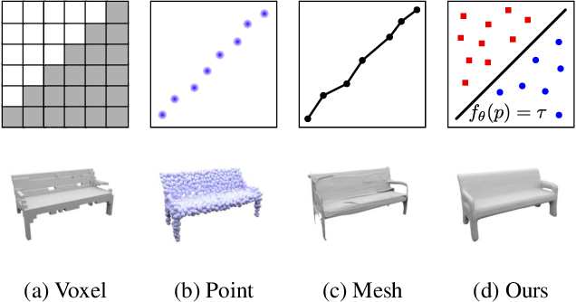
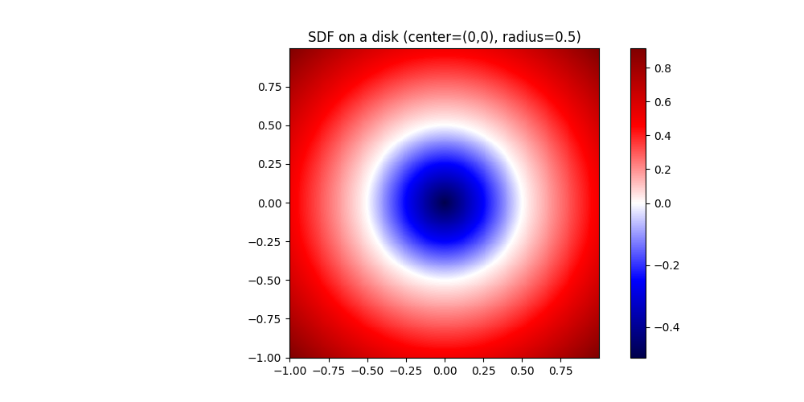
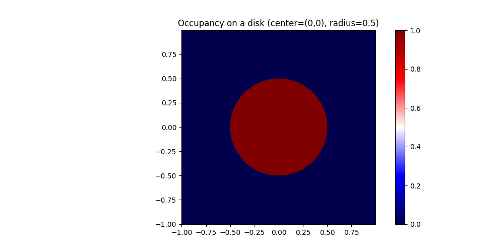
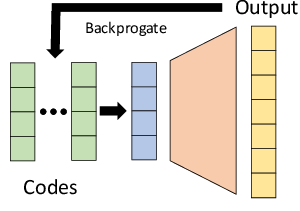
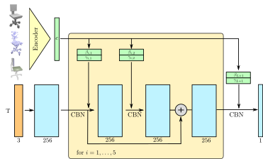
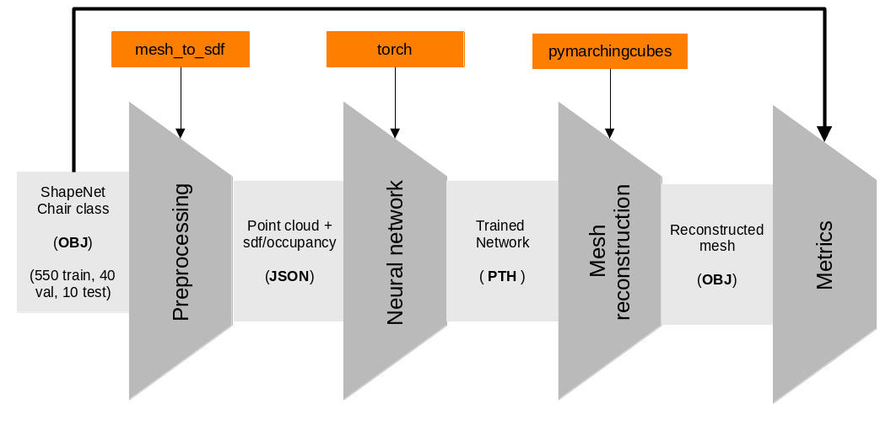

# Representing 3d shapes

{width=70%}

# Continuous representations

| SDF | Occupancy
|-|-
|$$
f(x) = \left\{\begin{array}{ll}
	d(x, \partial \Omega) & x \in \Omega \\
	-d(x, \partial \Omega) & x \notin \Omega
	\end{array}
	\right.
$$|$$
f(x) = \left\{\begin{array}{ll}
	1 & x \in \Omega \\
	0 & x \notin \Omega
	\end{array}
	\right.
$$|
| {width=40%} | {width=40%}

+ Can be approximated with neural networks
+ Mesh can easily be reconstructed with marching cubes

# Neural networks approaches

| Auto-decoder (DeepSDF) | Auto-encoder (ONet)
|-|-
| {width=40%} | {width=45%}

# Training setup

{width=60%}

+ For SDF: clamped $L_1$ loss: $\mathcal{L}(f_\theta(x), s) = | \text{clamp}(f_\theta(x), \delta), \text{clamp}(f_\theta(x), \delta) |$
+ Regularization on latent space (autodecoder): $\frac{1}{\sigma^2} ||z||_2^2$
+ For Occupancy: Binary cross entropy loss

# Results

\begin{figure}[!htb]
	\minipage{0.45\textwidth}
	\centering
	\includegraphics[height=50mm]{imgs/trainDeepSDF.png}
	\caption{DeepSDF training loss}
	\endminipage\hfill
	\minipage{0.45\textwidth}
        \centering
	\includegraphics[height=50mm]{imgs/trainONet.png}
	\caption{ONet training loss}
	\endminipage\hfill
\end{figure}

|  | mean chamfer | precision | recall
|-|-|-|-
|DeepSDF |    ||
|ONet |||

# Visuals

\begin{figure}[!htb]
	\minipage{0.22\textwidth}
	\centering
	\includegraphics[height=50mm]{imgs/orig.png}
	\caption{Original mesh}
	\endminipage\hfill
	\minipage{0.22\textwidth}
        \centering
	\includegraphics[height=50mm]{imgs/completion_DeepSDF.png}
	\caption{DeepSDF}
	\endminipage\hfill
	\minipage{0.22\textwidth}
        \centering
	\includegraphics[height=50mm]{imgs/completion_Onet.png}
	\caption{ONet}
	\endminipage\hfill
\end{figure}

# Conclusions

+ Train on a bigger dataset
+ Try other encoder architectures (for single view reconstruction in particular)
+ Train autoencoder on SDF and autodecoder on occupancy

# Biliography
